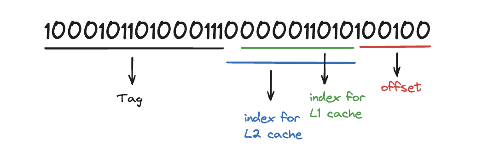

# Cache Simulator

Program starts by converting hex address to 32 bit binary. Starting from the right the first 6 bits are the offset bits for the 64B cache line. The next 9 bits represent the L1 cache index and the next 10 represent the L2 cache index. The remaining bits are the Tag bits.

