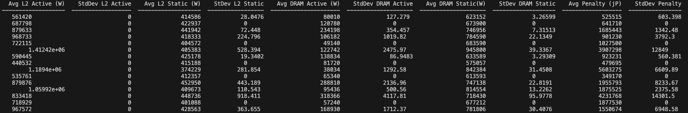

# Cache Simulator

Program starts by converting hex address to a 32 bit binary string. Starting from the right the first 6 bits are the offset bits for the 64B cache line. The next 9 bits represent the L1 cache index and the next 10 (could be 9 or 11 based on set associativity) represent the L2 cache index. The remaining bits are the Tag bits.

**Code Explanation**
The logic behind the cache simulator occurs in the 'simulate()' function in the Simulator class. You can change the input parameter on line 258 to change the L2 set associativity size. Also you can simply do 'python3 simulator.py' or utilize the 'run.sh' file to execute the program. Note that the program is set to do 10 cycles for each trace file and each trace file has around 1,000,000 memory accesses so it will take a while to execute. If you want to quicken the execution change the range of the for loop on line 257 to 2. Note that you cannot put it to 1 since the statistics library will throw an error for trying to find the mean of 1 value.

**Read:**
In the case of a read we start by checking the L1 cache at the L1_index for a tag match, this takes 0.5nsec. In the case of a miss, we go to the L2 cache at the L2_index and check for a tag match in the set. This takes 5nsec (0.5nsec for L1 and 4.5 for L2) and in the case of a hit we incur a penalty of 5pj for moving the cache line into the L1 cache. If both L1 and L2 miss then we go to DRAM, which takes 50nsec (0.5nsec for L1 and 4.5 for L2 and 45 for DRAM). We check for an empty spot in the L2 cache in the set at L2_index. If no empty spot is found we choose a random cache line to replace. Moving data from DRAM to L2 or from L2 to DRAM (in the case of a dirty eviction) incurs a total penalty of 640pj. Note that we incur a penalty of 640pJ even if we are only moving data from DRAM to L2 and not evicting a dirty cache line. Additionally, since we have an inclusive cache we have to make sure that the cache line we just evicted from L2 does not also currently exist in L1. In order to remedy this, we replace whatever is at L1_index with the new cache line brought in from DRAM and stored in L2. This takes a 5pj penalty for moving data from L2 to L1. 

**Write:**
Writes works pretty similar to reads with slight differences. We start by checking L1 for a tag match. If we get a hit this takes 5nsec (0.5nsec for L1 and 4.5 for L2) since we have to write through to L2. If we miss we go to L2. If we get a hit on the L2 cache then we write to L2 and move the updated cache line up to L1, we also mark the cache line as dirty and it takes 5nsec total. We also incur a 5pj penalty for moving data from L2 to L1. If both L1 and L2 miss we bring the cache line in from DRAM and replace a cache line in L2. We also update the respective cache line in L1 with the newly brought in cache line to maintain inclusivity. This takes no time according to specifications on Ed Discussion but we incur a penalty of 640pj for moving data between DRAM and L2 and 5pj for moving data between L2 and L1.

# Results 

**2 Set Associativity**

**4 Set Associativity**

**8 Set Associativity**

# Comments on Set Associativity
Looking at the results above we can see that lowering the set associativity leads to higher standard deviations and more variance between iterations. This is not surprisng since with smaller set sizes it is more likely we will have to execute our random replacement policy. Other than that most of the results seemed quite similar between all three set associativity levels, and I assume this was because the traces were accessing the same data over and over many times so we seldom had L1 cache misses. This idea is reiterated by looking at our average memory access time which is almost always below 1ns and our L1 cache hit rate which is no less than 98% for any set associativity.